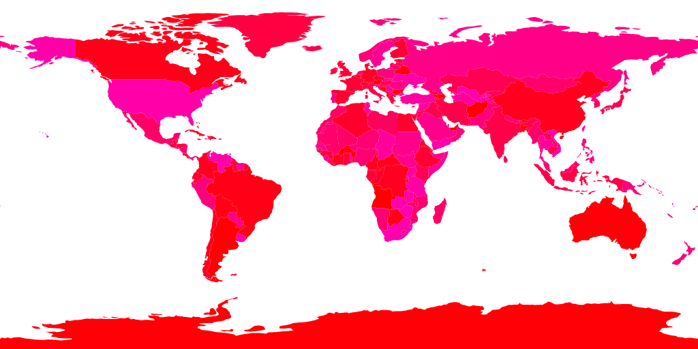
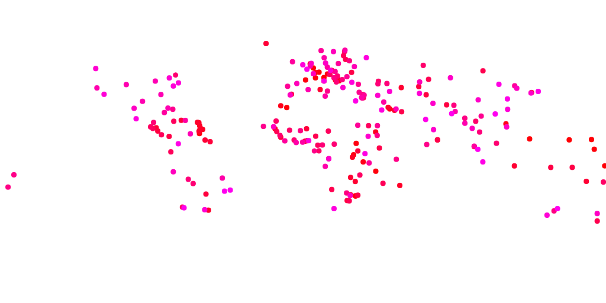
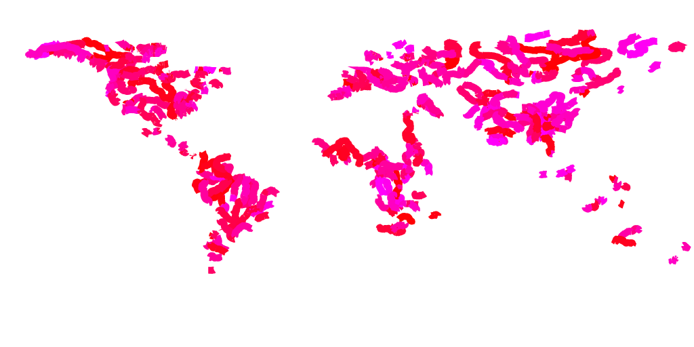

## aframe-geojson-component

A GeoJSON/TopoJSON component for [A-Frame](https://aframe.io).

> Supports A-Frame 0.6.0.

### API

This library provides two components visualizing GeoJSON and TopoJSON documents.

#### `geojson` component

The geojson component has the `material` and `geometry` components as a dependency from the entity. It implements a raycaster logic that fires an event if a GeoJSON feature gets selected.

##### Schema
| Property | Description | Default Value |
| -------- | ----------- | ------------- |
| src | The GeoJSON/TopoJSON asset. | "" |
| projection | One of [D3's projection](https://github.com/d3/d3-geo/blob/master/README.md#projections). Use the function name, like "geoEquirectangular" or "geoOrthographic". Use "geoEquirectangular" if you have global data and want to wrap it around a sphere. | "geoEquirectangular" |
| topologyObjct | *Only for TopoJSON*: Specifies the TopoJSON object to use (see [specification](https://github.com/topojson/topojson-specification#2-topojson-objects) for details). If empty then the first will be taken. | "" |
| featureKey | The primary key of the GeoJSON feature properties. Must be given and unique. For TopoJSON this is by specification always the _id_ property . For GeoJSON you have to select the _primary key_ | id |
| dataSrc | The optional metadata that of this GeoJSON document. Mostly GeoJSON contains already all the associated data, however TopoJSON have always associated data sources. | "" |
| dataType | The data type of the dataSrc attribute. Can be either *csv* or *tsv*. | csv |
| dataKey | The name of the property of the metadata that is matched to the GeoJSON's _featureKey_ attribute. | id |
| raycastResolution | The "resolution" of the raycaster selection. The smaller the closer you have to point with raycaster on the feature to be selected. Set smaller if you have many features close by, higher otherwise. Normalized to a generally good working condition. | 1 |
| featureEventName | The event name that should be added as a listener, for example `click` or `raycaster-intersected`. No events will be omitted if empty. | '' |

##### Events
| Name | Data | Description |
| -------- | ----------- | ------------- |
| geojson-generated | `{ map, features }`| Fired when the GeoJSON has finished loading (asynchronous operation!). `map` contains the loaded data, `features` contains all document features|
| geojson-feature-selected | `{ feature }`| The selected feature by the raycaster if the _featureEventName_ parameter is given.  |

#### `geojson-canvas` component

This component so far can be just used as a texture for a geometry object (plane, sphere, etc). No feature selection events are fired. A strategy may be implemented in future releases. 

##### Schema
| Property | Description | Default Value |
| -------- | ----------- | ------------- |
| src | The GeoJSON/TopoJSON asset. | "" |
| topologyObjct | *Only for TopoJSON*: Specifies the TopoJSON object to use (see [specification](https://github.com/topojson/topojson-specification#2-topojson-objects) for details). If empty then the first will be taken. | "" |
| canvas | The DOM canvas to use as the texture | "" |
| projection | One of [D3's projection](https://github.com/d3/d3-geo/blob/master/README.md#projections). Use the function name, like "geoEquirectangular" or "geoOrthographic". Use "geoEquirectangular" if you have global data and want to wrap it around a sphere. | "geoEquirectangular" |
| fillColor | Polygon filling color | "#fff" |
| fillOpacity | Opacity of the polygons | "1" |
| lineColor | Line color | "#fff" |
| lineOpacity | Line opacity | "1" |
| center | The center of the projection. See the D3 documentation for details and use cases. | "0 0" |
| rotation | The rotation of the projection. See the D3 documentation for details and use cases. | "0 0" |


##### Events
| Name | Data | Description |
| -------- | ----------- | ------------- |
| geojson-canvas-generated | _None_| Fired when the GeoJSON has finished loading (asynchronous operation!). |


##### API
| Name | Data | Description |
| -------- | ----------- | ------------- |
| getProjection | _None_| Returns the referenced `D3 projection` object that may be used for calculations or transformations. |
| draw | _None_| Redraws the canvas. |

### Styling
The library respects the commonly used [Geojson Styling Spec](https://github.com/mapbox/simplestyle-spec)

### Installation

#### Browser

Install and use by directly including the [browser files](dist):

```html
<head>
  <title>My A-Frame Scene</title>
  <script src="https://aframe.io/releases/0.6.0/aframe.min.js"></script>
  <script src="https://unpkg.com/aframe-geojson-component/dist/aframe-geojson-component.min.js"></script>
</head>

<body>
  <a-scene>
    <a-assets>
    <a-asset-item id="world-geojson" src="assets/world-50m.v1.json" />
    </a-assets>        

    <a-entity
      geometry="primitive: sphere; radius: 1;"
      material="color: #000;"
      geojson="
        src: #world-geojson; 
        topologyObject: countries;
        "
      />
  </a-scene>
</body>
```

<!-- If component is accepted to the Registry, uncomment this. -->
<!--
Or with [angle](https://npmjs.com/package/angle/), you can install the proper
version of the component straight into your HTML file, respective to your
version of A-Frame:

```sh
angle install aframe-geojson-component
```
-->

#### npm

Install via npm:

```bash
npm install aframe-geojson-component
```

Then require and use.

```js
require('aframe');
require('aframe-geojson-component');
```

### Antimeridian Cutting
Most GeoJSON objects might show a line on the antimeridian when projected on a sphere with the equirectangular projection.

To prevent this the original GeoJSON object has to be stitched manually beforehand.

See
* https://github.com/d3/d3-geo-projection#geostitch
* https://bl.ocks.org/mbostock/3788999
for details from the great @mbostock himself.


### Implementation details
The componenet uses the D3 library to convert the Geojson object into a SVG.
The SVG is then converted into THREE.Js lines and point geometires. 

To be able to interact with the generated geometires an invisble hit mask is generated for all GeoJSON polygon, line and points to obtain the selected geojson feature via raycasting (much faster than via meshes).



or for point geometries



and finally for line geometries



Those various masks that are generated depending on the GeoJSON contents get then laid over onto a mesh.

I have seen this idea and method implemented by the wonderful @thespite and enhanced it for more use cases.
